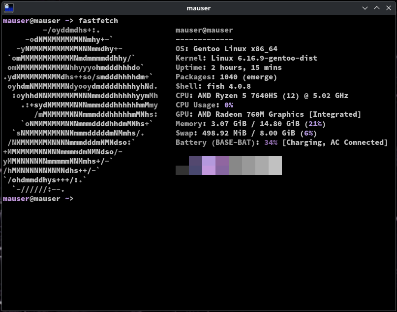

# blutordn shitty dotfiles
## fastfetch config -> config.jsonc
## ghostty config -> config
### requirements
- arch: ```sudo pacman -S adobe-source-code-pro-fonts fastfetch ghostty```
- gentoo: ```sudo emerge --ask ghostty source-code-pro fastfetch```
- ubuntu: (manually install ghostty -> https://github.com/mkasberg/ghostty-ubuntu/releases; font (if you wan use another - edit "font-family" in ghostty config) -> https://github.com/adobe-fonts/source-code-pro)
### installing fastfetch on ubuntu:
1. ```sudo add-apt-repository ppa:zhangsongcui3371/fastfetch```
2. ```sudo apt update && apt install fastfetch```

if you don't use arch - change fastfetch config:
```
"logo": {
        "source": "<your distro name>"
    },
```

<p align="center">example</p>
